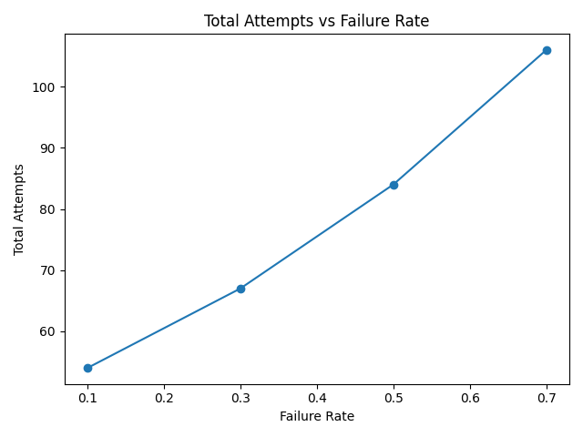
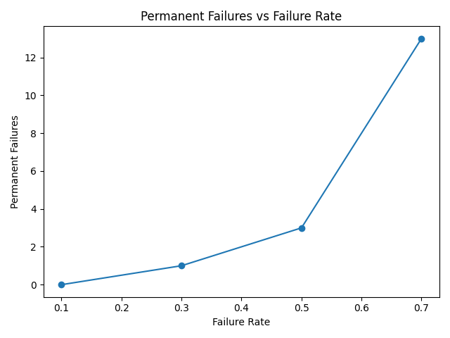

# Retry Storm & Cascading Failure Simulator

A discrete-time simulation framework for studying how retries, failures, and recovery limits interact under increasing failure pressure.

This project explores how failure-handling mechanisms can unintentionally amplify system load and reduce overall reliability — a phenomenon commonly known as a **retry storm**.

---

## Overview

Modern systems often retry failed work automatically.  
Retries can improve reliability when failures are rare.

However, under high failure rates:

- retries create additional load
- additional load increases system pressure
- recovery success decreases
- permanent failures increase

This simulator provides a controlled environment to study those dynamics.

---

## What This Simulator Models

The system includes:

- Initial job workload
- Random processing failures
- Configurable retry limits per job
- Requeueing of failed jobs
- Retry amplification of total work
- Permanent failure when retry budget is exhausted
- Queue depth tracking
- Repeatable experiments using fixed random seeds

---

## Core Questions Explored

- How much extra work do retries create?
- At what failure rate do retries stop helping?
- When does system effort increase while outcomes worsen?
- How do permanent failures scale with failure pressure?

---

## Metrics Collected

- Jobs created
- Total processing attempts
- Successful completions
- Failed attempts
- Retries issued
- Permanent failures
- Maximum queue depth

---

## Example Findings

### Retry amplification

With 50 original jobs:

| Failure Rate | Total Attempts |
|-------------|----------------|
| 0.10        | 54             |
| 0.30        | 67             |
| 0.50        | 84             |
| 0.70        | 106            |

Higher failure rates dramatically increased total system work.

---

### Recovery limits

As failure pressure increased:

- retries increased
- permanent failures increased
- successful completions decreased

At high failure rates, retry effort grew while outcomes degraded.

This demonstrates how retries can amplify instability under severe conditions.

---

## Example Outputs

The simulator generates:

- Experiment summary tables
- CSV results files
- Total Attempts vs Failure Rate plots
- Permanent Failures vs Failure Rate plots

---

## Example Plots

### Total Attempts vs Failure Rate


### Permanent Failures vs Failure Rate


## Project Structure
```
retry-storm-simulator/
├── sim/
│ ├── engine.py
│ ├── job.py
│ ├── metrics.py
│ ├── queue_manager.py
│ └── workers.py
├── scripts/
│ ├── run_experiment.py
│ └── plot_results.py
├── results/
├── README.md
└── requirements.txt
```

---

## Quick Start

### 1. Create environment

```bash
python3 -m venv venv
source venv/bin/activate
pip install matplotlib
```

### 2. Run experiment
python -m scripts.run_experiment

### 3. Generate plots
python scripts/plot_results.py

Results will be saved in the results/ folder.

---

### Future Extensions

Possible next steps:

- Exponential backoff retry strategies

- Retry jitter and scheduling delays

- Queue prioritisation policies

- Circuit breaker behaviour

- Dynamic worker capacity

- Time-based arrival modelling

- Cascading multi-service simulations

---

### Purpose

This project is part of a systems engineering portfolio exploring:

- System behaviour under stress

- Overload protection mechanisms

- Failure amplification dynamics

- Resilience tradeoffs

It is designed as an experimental learning and research tool rather than a production system.

---


## License

MIT